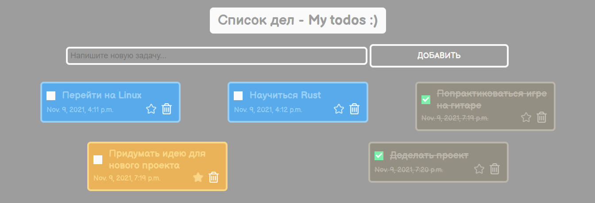

# Список дел - todos! ~ Мой супер классный проект
## Список личных задач созданный на **Django** с системой **сохранения** и **управления данными** в базе данных.

### НАПОМИНАНИЕ:
- При инициализации проекта утерялся `.gitignore` так что в репозитории находится много кэша и разные секретные ключи. Просьба использовать проект только в личных целях.

> Курсы *"Основы программирования"* от **Digital Academy** со спонсортсвом **Beeline**.
> 
> (2021) Касмамытов Санжар Нурэльдикович.